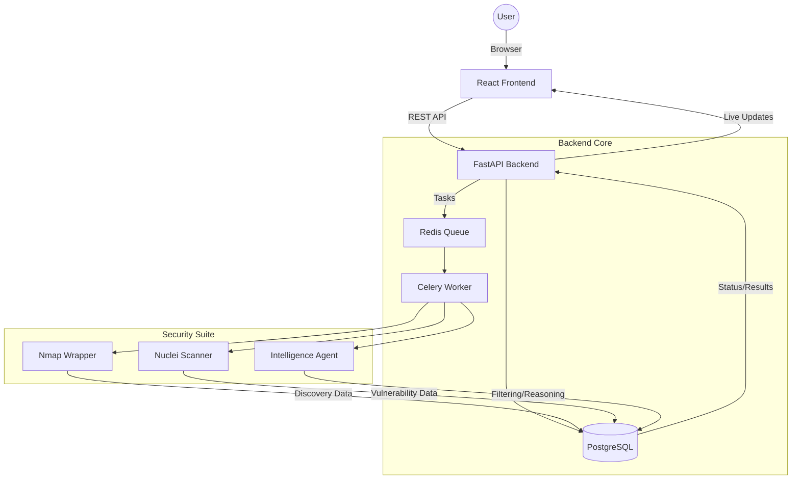

# found 404: Architecture Deep Dive

This document explains the internal structure of the **found 404** platform, the role of each file, and how they connect to form a cohesive AI-driven security testing system.

---

## 🏗️ High-Level System Architecture

The following diagram illustrates how the components interact:

---

## 📂 Backend Breakdown (`/backend`)

The backend is built with **FastAPI** and follows a modular service-oriented architecture.

### 📍 Core API & Entry Point
- **`app/main.py`**: The heart of the application. It initializes the FastAPI app, sets up CORS for the frontend, and includes all the API routers.
- **`app/api/api.py`**: The main router that aggregates all sub-routers (v1).
- **`app/api/v1/endpoints/`**:
    - **`scans.py`**: Manages scan lifecycles (start, stop, status). Connects to Celery to trigger background jobs.
    - **`network.py`**: Fetches discovered assets and their relationships for the topology graph.
    - **`vulnerabilities.py`**: Provides access to detected vulnerabilities and their details.
    - **`targets.py`**: Handles target management (IP ranges, URLs).
    - **`reports.py`**: Triggers PDF generation and retrieval.

### ⚙️ Services (The Engines)
These files contain the logic for interacting with external tools and AI:
- **`app/services/intelligence_agent.py`**: The "Intelligence Core". It classifies assets and synthesizes risk insights using Gemini.
- **`app/services/nmap_wrapper.py`**: Executes Nmap commands for discovery and parses the XML results into the database.
- **`app/services/nuclei_wrapper.py`**: Manages Nuclei scans for targeted vulnerability testing.
- **`app/services/intelligence_agent.py`**: Interfaces with Google Gemini to provide remediation advice and explain vulnerabilities.
- **`app/services/risk_engine.py`**: Calculates the overall risk score (0-100) based on vulnerability severity and asset importance.
- **`app/services/scan_tasks.py`**: Contains the actual Celery tasks that run Nmap, Nuclei, and AI analysis in the background.

### 💾 Data & Configuration
- **`app/models/scan.py`**: Defines the database tables (Assets, Scans, Vulnerabilities, Services) using SQLAlchemy.
- **`app/schemas/scan.py`**: Pydantic models used for API request/response validation.
- **`app/core/database.py`**: Handles the connection to the PostgreSQL database.
- **`app/core/celery_app.py`**: Configures the Celery worker and connects it to Redis.

---

## 🎨 Frontend Breakdown (`/frontend`)

The frontend is a **React** application built with **Vite** and **Tailwind CSS**.

### 🧩 Components (`src/components/dashboard/`)
- **`Dashboard.jsx`**: The main orchestration component for the dashboard layout.
- **`NetworkTopology.jsx`**: Uses **D3.js** and **React Force Graph** to visualize the network assets discovered by Nmap.
- **`AssetDetailPanel.jsx`**: A slide-out panel that shows detailed info (services, OS, CVEs) when an asset is clicked.
- **`ScanHistory.jsx`**: Displays a timeline of previous scans and their results.
- **`VulnerabilitiesPanel.jsx`**: A list/table view of all findings across the network.
- **`ActionCenter.jsx`**: The interface to start new scans and manage active tasks.

### 🔗 Integration
- **`src/services/api.js`**: A centralized Axios configuration for making calls to the Backend API. It handles base URLs and standard headers.

---

## 🧪 Simulation Lab (`/lab_config`)

Built to allow testing without real-world targets.
- **`docker-compose.lab.yml`**: Defines a private Docker network and 5 vulnerable containers (Gateway, DB, File Server, HR Workstation, Dev Laptop).
- **`lab_config/entrypoint.sh`**: A script that runs inside the lab nodes to simulate specific OS behaviors and vulnerable services (like a misconfigured Redis or SMB).

---

## 🔄 How They Connect (The Flow)

1. **User** enters a target range in the **UI** (`ActionCenter.jsx`).
2. **Frontend** calls the **Backend API** (`scans.py`).
3. **Backend** saves the scan record to **PostgreSQL** and sends a task to **Redis**.
4. **Celery Worker** picks up the task and runs **Nmap** (`nmap_wrapper.py`).
5. **Nmap results** are parsed and saved as **Assets** in the DB.
6. **Agent Orchestrator** triggers **Nuclei** and **AI Agents** based on the discovered services.
7. Discoveries are updated in real-time on the **UI** via the **Network Topology** graph.
