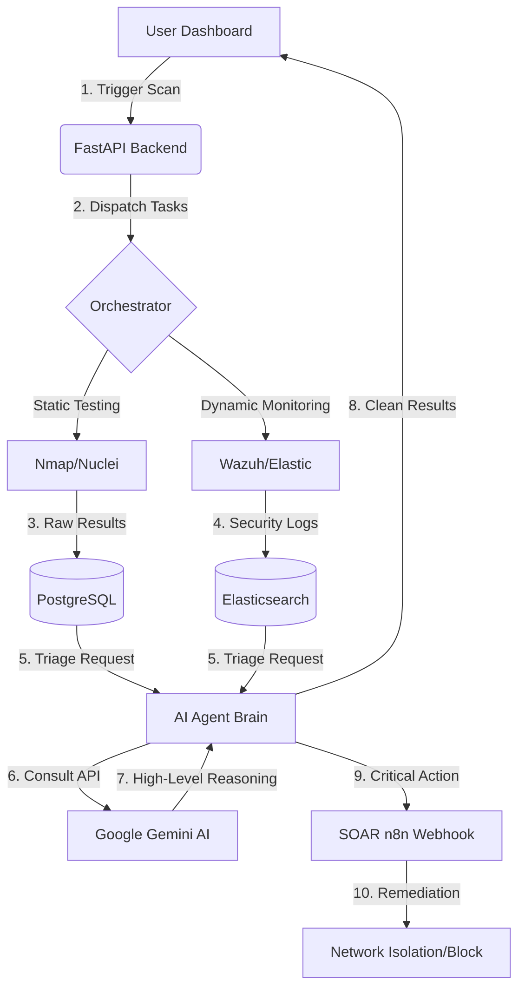

# 🛡️ found 404: The Intelligence Security Hub
**AI-Driven Security Testing for the Modern Network**

---

## 📺 PART 1: The Presentation (Slides)

### 🌎 Slide 1: The Problem
**Why is Small Business Security Hard?**
*   **The "Noise"**: Scanners find hundreds of "bugs," but which ones actually matter?
*   **Lack of Context**: Most tools don't understand how your business apps work.
*   **Expert Gap**: Hiring a full-time security team is expensive.
*   **Invisible Threats**: You can't fix what you can't see.

---

## 📽️ Slide 2: The Data Flow (Architecture)
### *From Scanning to Automated Response*

### 📝 Explanation of the Flow:
1.  **Initiation**: The user starts a scan or monitors the live feed from the **React Dashboard**.
2.  **Orchestration**: The **FastAPI Backend** acts as the central command, dispatching work to **Nmap** (for mapping) and **Nuclei** (for deep testing).
3.  **Storage**: Results are collected in **PostgreSQL** (for assets/vulns) and **Elasticsearch** (for real-time logs).
4.  **AI Intelligence**: The **AI Agent** pulls these raw logs and talks to **Google Gemini**. Instead of just counting bugs, it "understands" the attack path.
5.  **Output & Action**: The "clean" data is returned to the UI for the user. If a threat is critical, the **SOAR Agent** automatically hits **n8n** to block the attacker immediately.

---

### 🚀 Slide 3: The Solution
**Meet found 404**
found 404 isn't just a scanner; it's a **Neural Security Hub**.
*   **Autonomous**: It thinks like a hacker to find weaknesses.
*   **Smart**: Uses Google Gemini AI to filter out "fake" alerts.
*   **Visual**: Shows you your entire network as a digital map.
*   **Educational**: Explains exactly *how* to fix problems in plain English.

---

---

### 🗺️ Slide 4: Interactive Dashboard & SIEM
**Your Security "Command Center"**
*   **Network Topology**: A live, interactive map of every device on your network (Printers, Servers, Laptops).
*   **Unified SIEM Inbox**: (New) Real-time alert feed from **Wazuh** and **Elasticsearch**.
*   **Real-Time Status**: Green = Safe, Yellow = Warning, Red = Danger.
*   **One-Click Scanning**: Simple interface designed for everyone, not just "geeks."

---

### 🧠 Slide 5: The "Brain" (AI Integration)
**How Gemini AI Helps You**
We integrated **Google Gemini 1.5 Flash-Latest** to act as your virtual security consultant.
*   **Reasoning**: Explains risks in human terms (e.g., *"This database is exposed to a brute-force attack."*).
*   **SOAR Orchestration**: If Gemini identifies a "Critical Threat," the **SOAR Agent** automatically triggers a remediation playbook.
*   **False Positive Filtering**: Saves time by ignoring "noise" that other scanners miss.

---

### 🧪 Slide 6: The Infrastructure (The Professional Stack)
**Powered by Docker & Microservices**
| Layer | Technologies | Role |
|---|---|---|
| **Monitoring** | **Wazuh Manager** | Endpoint intrusion detection & FIM. |
| **Log Storage** | **Elasticsearch** | High-speed indexing of security events. |
| **Automation** | **n8n** | The SOAR engine executing response workflows. |
| **Intelligence** | **FastAPI** | The central orchestrator container. |

---

### 🛠️ Slide 7: The "A to Z" Technical Flow
**How a Threat is Handled Automatically**
1.  **Detection**: Brute force attack is detected by the **Wazuh Agent**.
2.  **Aggregation**: Logs are shipped to **Elasticsearch**.
3.  **Triage**: Our **SIEM Agent** pulls the logs and asks **Gemini** for an assessment.
4.  **Decision**: Gemini analyzes the context and confirms: *"This is a real attack targeting the Root user."*
5.  **Action**: The **SOAR Agent** hits an **n8n Webhook** to isolate the host or block the attacker's IP.

---

### 📊 Slide 8: Advantages & Disadvantages

#### ✅ **Advantages**
- **Unified Vision**: One dashboard for both static vulnerabilities and live threats.
- **AI-Native**: Drastically reduced manual triage time.
- **Cost-Effective**: Built with elite open-source tools.
- **Visual**: Easy to explain to non-technical stakeholders.

#### ⚠️ **Disadvantages**
- **Hardware Demand**: Requires at least 16GB RAM for the full container stack.
- **API Dependency**: Real-time AI analysis requires a stable internet connection for the Gemini API.

---

### 🏁 Slide 9: Summary & Vision
**Why found 404?**
1.  **Visibility**: See your network.
2.  **Intelligence**: Understand your risks.
3.  **Simplicity**: Act without needing a PhD in Security.

---

## 🔍 PART 2: Deep Dive (Q&A Overview)

### 🎯 General Goals & Vision
**Q: What is found 404?**  
**A:** It's an **Autonomous SIEM/SOAR & DAST Ecosystem**. It acts as a 24/7 security analyst that identifies, validates, and remediates security threats automatically.

**Q: Who is it for?**  
**A:** Businesses that need professional security monitoring but don't have the budget for a full-scale Security Operations Center (SOC).

---

### 🚀 Core Features
**Q: How does the SOAR work?**  
**A:** It uses **n8n** as a workflow engine. When the AI backend finds a critical issue, it "talks" to n8n to execute pre-built security playbooks.

**Q: How is the Network Topology mapped?**  
**A:** By combining **Nmap** service scanning with **Elasticsearch** log data to build a complete map of the digital environment.

---

### 🛠️ Technology Stack
**Backend**: FastAPI, Celery, Redis, PostgreSQL, Wazuh, Elasticsearch.  
**Frontend**: React, Vite, Tailwind CSS, Three.js.  
**Intelligence**: Google Gemini LLM.

---

**found 404** — *Neural Asset Discovery & Intelligence Hub.*
