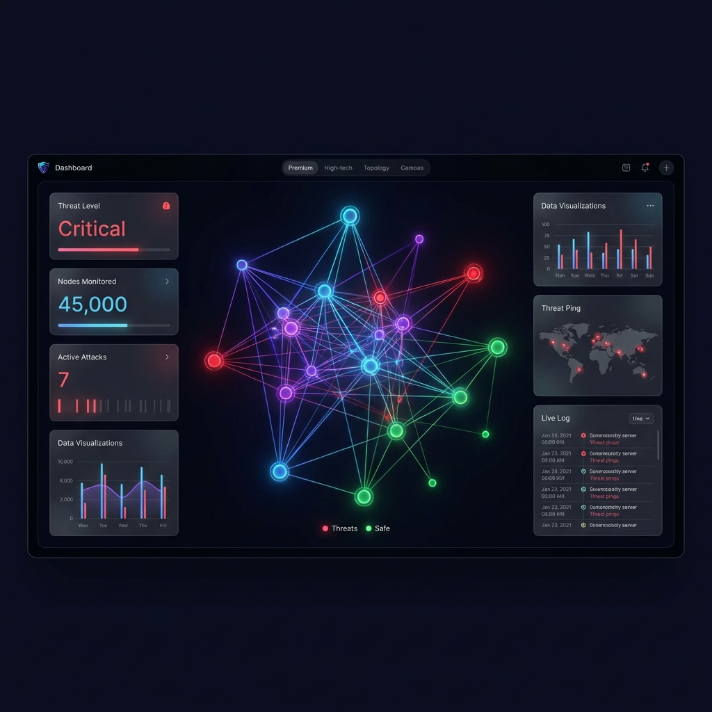

# 🛡️ PentesterFlow: The Complete Project Guide
**AI-Driven Security Testing for the Modern Network**

---

## 📺 PART 1: The Presentation (Slides)

### 🌎 Slide 1: The Problem
**Why is Small Business Security Hard?**
*   **The "Noise"**: Scanners find hundreds of "bugs," but which ones actually matter?
*   **Lack of Context**: Most tools don't understand how your business apps work.
*   **Expert Gap**: Hiring a full-time security team is expensive.
*   **Invisible Threats**: You can't fix what you can't see.

---

### 🚀 Slide 2: The Solution
**Meet PentesterFlow**
PentesterFlow isn't just a scanner; it's an **AI-Powered Security Agent**.
*   **Autonomous**: It thinks like a hacker to find weaknesses.
*   **Smart**: Uses Google Gemini AI to filter out "fake" alerts.
*   **Visual**: Shows you your entire network as a digital map.
*   **Educational**: Explains exactly *how* to fix problems in plain English.

---

### 🗺️ Slide 3: Interactive Dashboard
**Your Security "Command Center"**

*   **Network Topology**: A live, interactive map of every device on your network (Printers, Servers, Laptops).
*   **Real-Time Status**: Green = Safe, Yellow = Warning, Red = Danger.
*   **One-Click Scanning**: Simple interface designed for everyone, not just "geeks."

---

### 🧠 Slide 4: The "Brain" (AI Integration)
**How Gemini AI Helps You**

We integrated **Google Gemini 1.5 Flash** to act as your virtual security consultant.
*   **Reasoning**: Instead of just saying "Port 80 is open," the AI explains: *"This is a risk because your website is vulnerable to a specific 2024 attack."*
*   **Remediation**: It provides a step-by-step guide to fixing the issue.
*   **False Positive Filtering**: It saves you time by ignoring irrelevant alerts that other scanners might miss.

---

### 🧪 Slide 5: The Virtual Lab
**Practice Without Risk**
PentesterFlow comes with a **Simulated Corporate Network**.
*   **Safe Playground**: Test the scanner on a fake "Office Network" (Router, HR PC, Database Server).
*   **Real Vulnerabilities**: We've included real-world (but safe) misconfigurations like "WannaCry Risk" and "Weak Passwords."
*   **Immediate Feedback**: See how a real attack would look before it happens to your actual business.

---

### ⚙️ Slide 6: Technical "Magic" (Simplified)
**What’s Under the Hood?**
*   **Frontend (The Face)**: Built with **React** for a smooth, app-like experience.
*   **Backend (The Engine)**: Powered by **FastAPI** to handle heavy data quickly.
*   **Sensors**: Uses industry-standard tools (**Nmap** & **Nuclei**) as its "eyes and ears."
*   **The Cloud**: Leveraging **Docker** for "push-button" deployment anywhere.

---

### 🔮 Slide 7: The Future
**Where are we going?**
*   **Visual Analysis**: AI that can "see" website screenshots to find UI bugs.
*   **Enterprise Scaling**: Support for large companies and cloud networks.
*   **Auto-Healing**: Imagine a system that doesn't just find a bug, but suggests the code to fix it automatically.

---

### 🏁 Slide 8: Summary
**Why PentesterFlow?**
1.  **Visibility**: See your network.
2.  **Intelligence**: Understand your risks.
3.  **Simplicity**: Act without needing a PhD in Security.

---

## 🔍 PART 2: Deep Dive (Q&A Overview)

### 🎯 General Goals & Vision
**Q: What is PentesterFlow?**  
**A:** PentesterFlow is a professional-grade **Agentic Dynamic Application Security Testing (DAST)** platform. It is designed to act as an autonomous security researcher that doesn't just scan for bugs but "understands" the context of the applications it tests.

**Q: Why was PentesterFlow created?**  
**A:** Traditional security scanners often produce a lot of "noise" (false positives) and lack the context to understand complex application flows. PentesterFlow was created to bridge this gap by using **AI Agents** that can reason about vulnerabilities, validate findings, and provide actionable security intelligence.

---

### 🚀 Core Features
**Q: What makes PentesterFlow "Agentic"?**  
**A:** Instead of a linear script, the platform uses specialized AI agents:
- **Recon Agent**: Maps out the target and finds hidden entry points.
- **Attack Agent**: Crafts specific payloads based on the technologies it discovers.
- **Validation Agent**: Uses LLMs (Google Gemini) to double-check if a vulnerability is real or a false alarm.

**Q: How does it handle asset discovery?**  
**A:** It integrates deeply with **Nmap** for network scanning, OS detection, and service fingerprinting. It then visualizes this data in an interactive **Network Topology Graph**, making it easy to see the "attack surface."

**Q: What is the vulnerability engine?**  
**A:** It leverages **Nuclei**, a powerful template-based scanner, to look for thousands of known vulnerabilities, misconfigurations, and CVEs across web services, protocols, and network layers.

---

### 🛠️ Technology Stack
**Q: What technologies are used in the Backend?**  
**A:** 
- **Language**: Python 3.10+
- **Framework**: **FastAPI**
- **Database**: **PostgreSQL**
- **Task Queue**: **Celery** with **Redis**
- **Security Tools**: **Nmap**, **Nuclei**, **Playwright**

**Q: What technologies are used in the Frontend?**  
**A:** 
- **Framework**: **React** with **Vite**
- **Styling**: **Tailwind CSS**
- **Visualization**: **React Force Graph** and **D3.js**

---

### 🔮 The Future
**Q: What's next for PentesterFlow?**  
**A:** The roadmap includes:
- **Vision Integration**: Using AI to "see" screenshots of web pages.
- **Enterprise Features**: Role-Based Access Control (RBAC).
- **Cloud Scanning**: Specialized agents for AWS/Azure.
