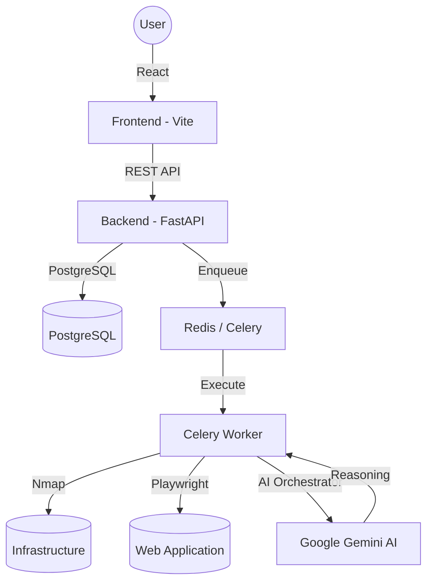

# 🏗️ found 404 Architecture

found 404 is built on a modern, distributed architecture designed for low-latency scanning and high-intelligence reasoning.

## 📡 System Overview

## 🛠️ Component Breakdown

### 1. Orchestration Layer (The "Brain")
The `AgentOrchestrator` manages the multi-agent state machine. It ensures that reconnaissance data flows into the attack agent, findings are validated by the LLM, and results are compiled by the reporting engine.

### 2. Execution Layer (The "Hands")
- **Nmap Wrapper**: Handles low-level socket scanning and service fingerprinting.
- **Crawling Engine**: Uses headless Chromium (via Playwright) to render Single Page Applications (SPAs) and extract dynamically generated links/forms.
- **Payload Engine**: Generates context-aware security payloads for SQL injection, XSS, and BOLA.

### 3. Intelligence Layer (The "Knowledge")
- **Intelligence Agent**: A dedicated service that interacts with Gemini Pro to provide human-readable executive summaries and remediation advice.
- **Validation Agent**: Operates as a noise filter, analyzing raw scanner output to confirm if a finding is truly exploitable.

### 4. Data Layer
- **PostgreSQL**: Stores persistent data including Targets, Scans, Vulnerabilities, and Agent Logs.
- **Redis**: Acts as the message broker for asynchronous scanning tasks and provides a state store for high-speed agent operations.
